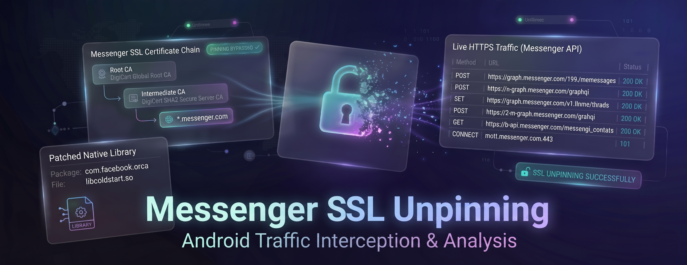
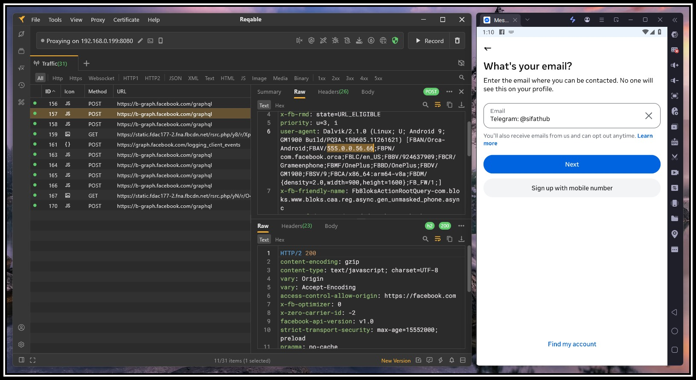

<div align="center">



<br/>


<br/>


</div>

---

## 📌 About
**Messenger SSL Pinning Bypass** is a reverse engineering project by **[Mr-SxR](https://github.com/Mr-SxR)**. It delivers patched versions of Messenger's `libcoldstart.so` native library, allowing security researchers to intercept HTTPS traffic from the official Messenger Android application for analysis and learning.

> Created by **Masudur Rahman Sifat**, a self-taught reverse engineer & Python developer from Bangladesh, known online as **Mr-SxR** *(Speciality & Reliability)*.

---

## 📦 Library Info
| | |
|---|---|
| **Package** | `com.facebook.orca` |
| **App Version** | `555.0.0.56.66` |
| **Architectures** | `ARM64-v8a` · `x86_64` · `x86` |
| **Bypass Method** | Binary patch, SSL verification skipped at entry point |

> 💡 Lib only works with the exact Messenger version shown above.

> ❓ Questions? → [](https://t.me/sifathub)

---

## 📸 Evidence
> Traffic captured via **Reqable** after replacing `libcoldstart.so` on a rooted device.



---

## ⬇️ Downloads
**Package:** `com.facebook.orca`

---

### ARM64 (Physical Devices)
| | |
|---|---|
| 📦 **libcoldstart.so** | [](https://github.com/Mr-SxR/Messenger-SSL-Pinning-Bypass/raw/main/ARM64/libcoldstart.so) |
| 📱 **Messenger APK** | [](https://www.apkmirror.com/apk/facebook-2/messenger/facebook-messenger-555-0-0-56-66-release/facebook-messenger-555-0-0-56-66-20-android-apk-download/) |

> 💡 Pick variant: `arm64-v8a` · `nodpi` · APK type (not Bundle)

---

### x86_64 (Emulators)
| | |
|---|---|
| 📦 **libcoldstart.so** | [](https://github.com/Mr-SxR/Messenger-SSL-Pinning-Bypass/raw/main/x86_64/libcoldstart.so) |
| 📱 **Messenger APK** | [](https://www.apkmirror.com/apk/facebook-2/messenger/facebook-messenger-555-0-0-56-66-release/facebook-messenger-555-0-0-56-66-5-android-apk-download/) |

> 💡 Pick variant: `x86_64` · `nodpi` · APK type (not Bundle)

---

### x86 (Emulators)
| | |
|---|---|
| 📦 **libcoldstart.so** | [](https://github.com/Mr-SxR/Messenger-SSL-Pinning-Bypass/raw/main/x86/libcoldstart.so) |
| 📱 **Messenger APK** | [](https://www.apkmirror.com/apk/facebook-2/messenger/facebook-messenger-555-0-0-56-66-release/facebook-messenger-555-0-0-56-66-9-android-apk-download/) |

> 💡 Pick variant: `x86` · `nodpi` · APK type (not Bundle)

> 💡 Recommended emulators: **LDPlayer** and **NoxPlayer**. Others also work as long as root is enabled.

---

## ⚙️ Requirements
- ✅ **Rooted Android**, required for write access to Messenger's native library path
- ✅ **Messenger APK** (exact version from the table above)
- ✅ **ADB** or **MT Manager**, to push the patched `libcoldstart.so` into place
- ✅ **Burp Suite**, **Reqable**, or **HTTP Canary**, set up with a trusted CA certificate

---

## 🔧 Setup Process

### Step 1: Replace libcoldstart.so
Pick the right patched `libcoldstart.so` from the **Downloads** section above and replace the original file at:

```
/data/data/com.facebook.orca/lib-compressed/libcoldstart.so
```

**Backup (optional):** You can backup the original before replacing. It's your choice.

**Replace via ADB:**
```bash
adb push [Patched-libcoldstart.so-Path] /data/data/com.facebook.orca/lib-compressed/libcoldstart.so
```

> 💡 Don't have a PC for ADB? Use **MT Manager** on your Android device or emulator to replace the file directly.

---

### Step 2: CA Certificate Setup *(if needed)*
Your proxy tool (**Burp Suite**, **Reqable**, or **HTTP Canary**) needs its CA certificate installed and trusted on the device.

> If the certificate isn't installed yet, do that first before moving on.

---

### Step 3: Set Proxy & Capture Traffic
**Using Burp Suite or Reqable (PC-based):**

> Required only for desktop proxy tools. Your device needs to route its traffic to your PC manually via Wi-Fi proxy settings.

1. Run Burp Suite / Reqable on your PC and make sure it listens on all network interfaces
2. On the device: go to `WiFi Settings → Long press network → Modify → Proxy → Manual`  
   → Input your **PC's local IP** and the **port** your proxy uses (e.g. `8080`)
3. Launch Messenger → perform any action → watch the traffic flow into your proxy

**Using HTTP Canary (Mobile-only):**

> HTTP Canary handles everything on-device using Android's built-in VPN, so no manual proxy configuration is required. Start capturing and launch Messenger.

---

## ⚠️ Disclaimer
This repository is published strictly for educational and security research purposes, to study how native SSL pinning in Messenger's `libcoldstart.so` can be analyzed and bypassed.

The objective is to help developers and researchers understand certificate validation at the binary level, which ultimately leads to more secure mobile applications.

Unauthorized use is prohibited. Only test on devices and accounts you own or have explicit permission to use. The developer bears no responsibility for any misuse.

---

## 🛠️ Need Custom Work?
> Looking for a custom solution? Reach out, I build patches on demand.

- 🔓 **Non-rooted APK**: Messenger APK with SSL pinning already disabled, no root needed
- 🆕 **Up-to-date patches**: bypass for the latest Messenger version on request
- 📱 **Other apps**: custom SSL pinning bypass for any Android application
- 🐍 **Python & automation**: need a bot, scraper, or any Python-based tool? I build those too

Reach out on Telegram → [](https://t.me/sifathub)

---

## 📬 Contact
[](https://www.facebook.com/sifathub)
[](https://wa.me/+8801858094178)
[](https://t.me/sifathub)

> Questions, issues, or custom requests? Hit me up anytime.

---

<div align="center">

***[Mr-SxR](https://github.com/Mr-SxR)** — Speciality & Reliability*

</div>
